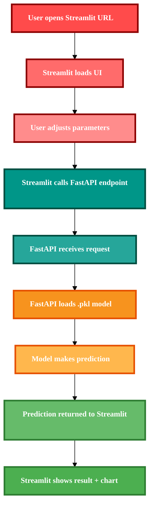
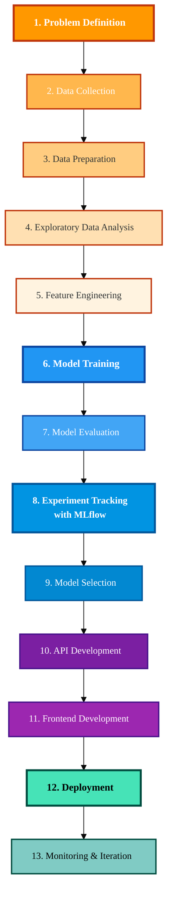
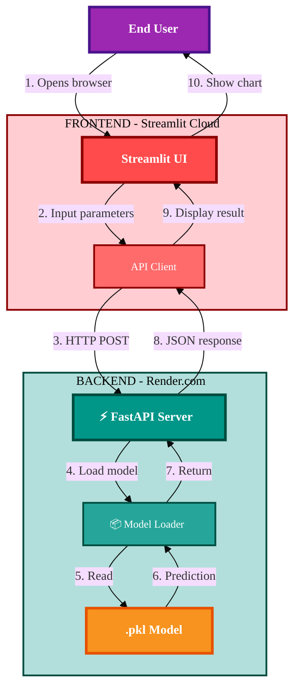

<!-- Badges Section -->
<p align="center">
  
  
  
  
  
  
  
</p>


--------------------------------------------------------------------------------------------

--------------------------------------------------------------------------------------------

## Gastroretentive Drug Release Rate Predictor

**Why I Created This Project**

- This project demonstrates how **AI and Machine Learning** can accelerate pharmaceutical formulation development.

- **The Problem:** Formulating gastroretentive tablets requires extensive trial-and-error testing to find the right combination of parameters (dose, pH, density, etc.) for optimal drug release.

- **The AI Solution:** A machine learning model that predicts drug release rate based on formulation parameters, reducing lab testing time.


**What This Project Shows:**

- ML applied to real pharmaceutical problems
  
- Complete end-to-end ML lifecycle
  
- Production-ready deployment (not just notebooks)
  
- Integration of ML model with web interface


--------------------------------------------------------------------------------------------

--------------------------------------------------------------------------------------------

## Problem Statement

Gastroretentive tablets are designed to float in the stomach for several hours, releasing medication slowly. 

However, predicting how fast a drug will release is complex because multiple factors interact:

**Factors Affecting Release Rate**


<table>
  <thead>
    <tr style="background-color: #2c3e50; color: white;">
      <th style="padding: 10px; border: 1px solid #ddd;">Factor</th>
      <th style="padding: 10px; border: 1px solid #ddd;">Impact on Release Rate</th>
    </tr>
  </thead>
  <tbody>
    <tr style="background-color: #f9f9f9;">
      <td style="padding: 8px; border: 1px solid #ddd;">Drug dose</td>
      <td style="padding: 8px; border: 1px solid #ddd;">Higher dose = faster release</td>
    </tr>
    <tr style="background-color: #ffffff;">
      <td style="padding: 8px; border: 1px solid #ddd;">Stomach pH</td>
      <td style="padding: 8px; border: 1px solid #ddd;">Affects dissolution rate</td>
    </tr>
    <tr style="background-color: #f9f9f9;">
      <td style="padding: 8px; border: 1px solid #ddd;">Matrix density</td>
      <td style="padding: 8px; border: 1px solid #ddd;">Denser = slower release</td>
    </tr>
    <tr style="background-color: #ffffff;">
      <td style="padding: 8px; border: 1px solid #ddd;">Drug type</td>
      <td style="padding: 8px; border: 1px solid #ddd;">Different drugs dissolve differently</td>
    </tr>
    <tr style="background-color: #f9f9f9;">
      <td style="padding: 8px; border: 1px solid #ddd;">Temperature</td>
      <td style="padding: 8px; border: 1px solid #ddd;">Body temperature affects reaction rate</td>
    </tr>
  </tbody>
</table>


--------------------------------------------------------------------------------------------

-------------------------------------------------------------------------------------------- 

## Tech Stack

<table>
  <thead>
    <tr style="background-color: #2c3e50; color: white;">
      <th style="padding: 10px; border: 1px solid #ddd;">Component</th>
      <th style="padding: 10px; border: 1px solid #ddd;">Technology</th>
      <th style="padding: 10px; border: 1px solid #ddd;">Purpose</th>
    </tr>
  </thead>
  <tbody>
    <tr style="background-color: #f9f9f9;">
      <td style="padding: 8px; border: 1px solid #ddd;"><b>Language</b></td>
      <td style="padding: 8px; border: 1px solid #ddd;">Python 3.10</td>
      <td style="padding: 8px; border: 1px solid #ddd;">Core programming language</td>
    </tr>
    <tr style="background-color: #ffffff;">
      <td style="padding: 8px; border: 1px solid #ddd;"><b>Model Training</b></td>
      <td style="padding: 8px; border: 1px solid #ddd;">scikit-learn, XGBoost</td>
      <td style="padding: 8px; border: 1px solid #ddd;">Train Random Forest and XGBoost models</td>
    </tr>
    <tr style="background-color: #f9f9f9;">
      <td style="padding: 8px; border: 1px solid #ddd;"><b>Experiment Tracking</b></td>
      <td style="padding: 8px; border: 1px solid #ddd;">MLflow</td>
      <td style="padding: 8px; border: 1px solid #ddd;">Log parameters, metrics, and model versions</td>
    </tr>
    <tr style="background-color: #ffffff;">
      <td style="padding: 8px; border: 1px solid #ddd;"><b>Backend API</b></td>
      <td style="padding: 8px; border: 1px solid #ddd;">FastAPI</td>
      <td style="padding: 8px; border: 1px solid #ddd;">Serve model predictions via REST API</td>
    </tr>
    <tr style="background-color: #f9f9f9;">
      <td style="padding: 8px; border: 1px solid #ddd;"><b>Frontend UI</b></td>
      <td style="padding: 8px; border: 1px solid #ddd;">Streamlit</td>
      <td style="padding: 8px; border: 1px solid #ddd;">Interactive dashboard for users</td>
    </tr>
    <tr style="background-color: #ffffff;">
      <td style="padding: 8px; border: 1px solid #ddd;"><b>Deployment</b></td>
      <td style="padding: 8px; border: 1px solid #ddd;">Render + Streamlit Cloud</td>
      <td style="padding: 8px; border: 1px solid #ddd;">Free cloud hosting</td>
    </tr>
    <tr style="background-color: #f9f9f9;">
      <td style="padding: 8px; border: 1px solid #ddd;"><b>Version Control</b></td>
      <td style="padding: 8px; border: 1px solid #ddd;">GitHub</td>
      <td style="padding: 8px; border: 1px solid #ddd;">Code and model versioning</td>
    </tr>
  </tbody>
</table>


--------------------------------------------------------------------------------------------

-------------------------------------------------------------------------------------------- 

## How the System Works



--------------------------------------------------------------------------------------------

-------------------------------------------------------------------------------------------- 

# ML Lifecycle Followed 





--------------------------------------------------------------------------------------------

-------------------------------------------------------------------------------------------- 


## Project Architecture




--------------------------------------------------------------------------------------------

-------------------------------------------------------------------------------------------- 

# Dashboard Input Parameters

The Streamlit dashboard accepts these input parameters:

<table>
  <thead>
    <tr style="background-color: #2c3e50; color: white;">
      <th style="padding: 10px; border: 1px solid #ddd;">Parameter</th>
      <th style="padding: 10px; border: 1px solid #ddd;">Range</th>
      <th style="padding: 10px; border: 1px solid #ddd;">Description</th>
    </tr>
  </thead>
  <tbody>
    <tr style="background-color: #f9f9f9;">
      <td style="padding: 8px; border: 1px solid #ddd;">Drug Type</td>
      <td style="padding: 8px; border: 1px solid #ddd;">Antibiotic, Antacid, Antiulcer, Nutraceutical</td>
      <td style="padding: 8px; border: 1px solid #ddd;">Type of active pharmaceutical ingredient</td>
    </tr>
    <tr style="background-color: #ffffff;">
      <td style="padding: 8px; border: 1px solid #ddd;">Dose (mg)</td>
      <td style="padding: 8px; border: 1px solid #ddd;">50 - 500</td>
      <td style="padding: 8px; border: 1px solid #ddd;">Amount of drug in the tablet</td>
    </tr>
    <tr style="background-color: #f9f9f9;">
      <td style="padding: 8px; border: 1px solid #ddd;">Stomach pH</td>
      <td style="padding: 8px; border: 1px solid #ddd;">1.5 - 5.0</td>
      <td style="padding: 8px; border: 1px solid #ddd;">Gastric pH level</td>
    </tr>
    <tr style="background-color: #ffffff;">
      <td style="padding: 8px; border: 1px solid #ddd;">Desired Release Duration (hours)</td>
      <td style="padding: 8px; border: 1px solid #ddd;">2 - 12</td>
      <td style="padding: 8px; border: 1px solid #ddd;">Target time for complete drug release</td>
    </tr>
    <tr style="background-color: #f9f9f9;">
      <td style="padding: 8px; border: 1px solid #ddd;">Matrix Density (g/cm³)</td>
      <td style="padding: 8px; border: 1px solid #ddd;">0.5 - 1.2</td>
      <td style="padding: 8px; border: 1px solid #ddd;">Tablet density affecting floating ability</td>
    </tr>
    <tr style="background-color: #ffffff;">
      <td style="padding: 8px; border: 1px solid #ddd;">Temperature (°C)</td>
      <td style="padding: 8px; border: 1px solid #ddd;">36 - 38.5</td>
      <td style="padding: 8px; border: 1px solid #ddd;">Body temperature</td>
    </tr>
  </tbody>
</table>


--------------------------------------------------------------------------------------------

-------------------------------------------------------------------------------------------- 


# Model Performance Comparison

<table>
  <thead>
    <tr style="background-color: #2c3e50; color: white;">
      <th style="padding: 10px; border: 1px solid #ddd;">Model</th>
      <th style="padding: 10px; border: 1px solid #ddd;">Test R2 Score</th>
      <th style="padding: 10px; border: 1px solid #ddd;">Test MAE</th>
      <th style="padding: 10px; border: 1px solid #ddd;">Status</th>
    </tr>
  </thead>
  <tbody>
    <tr style="background-color: #f9f9f9;">
      <td style="padding: 8px; border: 1px solid #ddd;">Linear Regression</td>
      <td style="padding: 8px; border: 1px solid #ddd;">~0.65</td>
      <td style="padding: 8px; border: 1px solid #ddd;">~15.2</td>
      <td style="padding: 8px; border: 1px solid #ddd;">Baseline</td>
    </tr>
    <tr style="background-color: #ffffff;">
      <td style="padding: 8px; border: 1px solid #ddd;">Decision Tree</td>
      <td style="padding: 8px; border: 1px solid #ddd;">~0.82</td>
      <td style="padding: 8px; border: 1px solid #ddd;">~9.8</td>
      <td style="padding: 8px; border: 1px solid #ddd;">Good</td>
    </tr>
    <tr style="background-color: #d4edda;">
      <td style="padding: 8px; border: 1px solid #ddd;"><b>Random Forest</b></td>
      <td style="padding: 8px; border: 1px solid #ddd;"><b>~0.89</b></td>
      <td style="padding: 8px; border: 1px solid #ddd;"><b>~7.2</b></td>
      <td style="padding: 8px; border: 1px solid #ddd;"><b>✅ Best after XGboost</b></td>
    </tr>
    <tr style="background-color: #ffffff;">
      <td style="padding: 8px; border: 1px solid #ddd;">XGBoost</td>
      <td style="padding: 8px; border: 1px solid #ddd;">~0.88</td>
      <td style="padding: 8px; border: 1px solid #ddd;">~7.5</td>
      <td style="padding: 8px; border: 1px solid #ddd;">✅ Selected</td>
    </tr>
  </tbody>
</table>

**Best Model Selected:** XGboost 


--------------------------------------------------------------------------------------------

-------------------------------------------------------------------------------------------- 

# Project Structure 

```mermaid
gastroretentive_ml_project/
│
├── backend/
│   ├── app.py
│   ├── model_loader.py
│   ├── requirements.txt
│   ├── Dockerfile
│   └── models/
│       ├── gastro_release_best_model.pkl
│       ├── label_encoder.pkl
│       ├── feature_columns.pkl
│       └── drug_type_mapping.pkl
│
├── frontend/
│   ├── streamlit_app.py
│   ├── api_client.py
│   └── requirements.txt
│
├── notebooks/
│   └── model_training.ipynb
│
├── data/
│   └── gastroretentive_data.csv
│
└── README.md
```


--------------------------------------------------------------------------------------------

-------------------------------------------------------------------------------------------- 


## Streamlit Frontend 


Streamlit app link: https://gastroretentive-release-predictor.streamlit.app/


**Troubleshooting: API Server Not Running**

- If you see the following error on the Streamlit app:

- "API server is not running. Please start the FastAPI backend first."

- This is normal for free-tier deployments.

- The FastAPI backend is hosted on Render's free tier, which puts the server to sleep after 15 minutes of inactivity.

- When you visit the Streamlit app, the backend may take 30–60 seconds to wake up.
 

  **How to Fix:**

- First, wake up the backend
  
- Open this link in a new browser tab: https://gastroretentive-release-predictor.onrender.com/
  
- Wait until you see{"message":"Gastroretentive Release Rate Predictor API is running","status":"active"}

- Then, refresh your Streamlit app Go back to the Streamlit app and refresh the page.

- The app should now work normally Once the backend is active, predictions will work instantly.

- Note: Render's free tier may take 30–60 seconds to spin up the server. This is not a bug, just how free hosting works.

- After the first request, subsequent requests will be fast.


--------------------------------------------------------------------------------------------

-------------------------------------------------------------------------------------------- 


# Important Note About Data

- The dataset used to train this model is synthetic, not real laboratory data. 

- It was generated to simulate the complete ML lifecycle, API development, and deployment process.

- For a deeper understanding of how the data was created and the model was trained, please explore the notebook:

- 📓 notebooks/model_training.ipynb

- Real-world deployment would require actual experimental data from lab testing.


